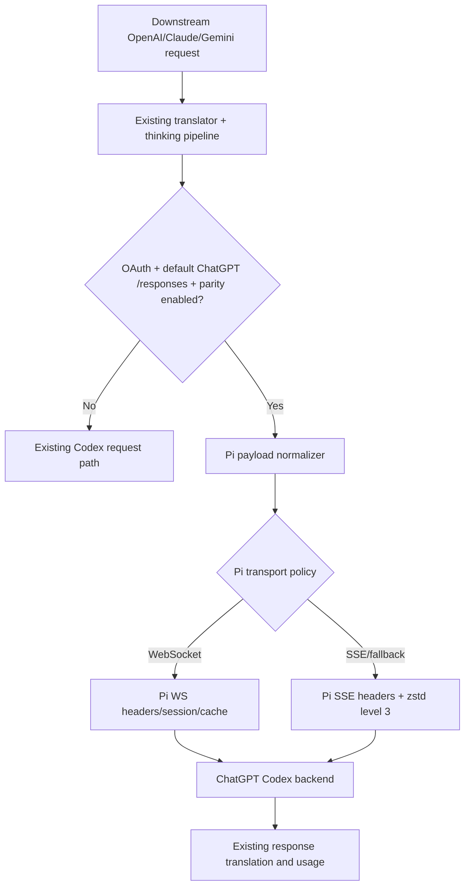

# 技术设计: Codex 上游请求严格模拟 Pi

## 技术方案

### 核心技术
- Go 1.26、`net/http`、现有 WebSocket executor。
- 复用仓库已有 `github.com/klauspost/compress/zstd`，不新增依赖。
- 参考实现固定为 `earendil-works/pi@853a80d26c90a14c1886f0ebb8ffaae133ca2185`。

### 方案比较与选择
1. **严格契约层（采用）:** 在 OAuth 标准后端路径集中生成 Pi 请求契约；HTTP 和 WebSocket 共用身份、account ID、session 和 payload 规范化逻辑。优点是边界明确、可测试、不会污染自定义后端。
2. **直接替换现有 Codex 默认常量（拒绝）:** 改动少，但会影响 API key、自定义 Base URL、Codex Desktop 兼容和 header override，无法满足兼容隔离。
3. **独立新增 Pi provider/executor（拒绝）:** 隔离最好，但复制 Codex executor、缓存和翻译逻辑，维护成本与漂移风险过高。

### 启用判定
新增内部判定 `isPiCodexUpstream(auth, baseURL)`，同时满足以下条件才启用：
- `auth` 为 OAuth Codex，而非 `AuthKindAPIKey`。
- 有 access token 和 account ID。
- Base URL 为空或规范化后等于 `https://chatgpt.com/backend-api/codex`。
- 目标是普通 `/responses`；compact、images 和 realtime 排除。

不增加面向下游的公共 API。增加配置 `codex.disable-pi-upstream-parity`，默认 `false`；设为 `true` 时恢复当前 Codex 请求构造，作为紧急回滚开关。该开关不改变自定义 Codex 后端行为。

### OAuth 契约
- `GenerateAuthURL` 使用 `scope=openid profile email offline_access`、PKCE S256、固定 redirect URI，并设置 `id_token_add_organizations=true`、`codex_cli_simplified_flow=true`、`originator=pi`。
- 移除 `prompt=login`。
- 登录和刷新都从 access token解析 account ID；ID token仅保留用于兼容保存 email/identity，不作为 account ID 权威来源。
- 刷新请求只发送 `grant_type`、`refresh_token`、`client_id`，移除额外 scope。
- 登录/刷新响应缺失 access、refresh 或有效 expires 时返回错误；refresh 响应若服务端未返回新 refresh token，是否保留旧值必须由契约测试确认。冻结 Pi 要求字段齐全，因此严格模式按缺失失败处理。
- 旧 token 文件仍按现有 schema 读取；下一次成功刷新后写回一致 account ID。

### 身份和 Header 契约
增加集中 helper，例如 `piCodexBaseHeaders`、`piCodexSSEHeaders`、`piCodexWebSocketHeaders`：

```text
Base:
  Authorization: Bearer <access token>
  chatgpt-account-id: <access token claim>
  originator: pi
  User-Agent: pi (<runtime OS> <OS release>; <arch>)

SSE:
  OpenAI-Beta: responses=experimental
  Accept: text/event-stream
  Content-Type: application/json
  session-id: <session>              # 仅有 session 时
  x-client-request-id: <session>     # 仅有 session 时

WebSocket:
  OpenAI-Beta: responses_websockets=2026-02-06
  x-client-request-id: <session or UUIDv7>
  session-id: <same request id>
  不发送 Accept/Content-Type
```

Pi-owned headers 在应用模型/配置附加头之后最终覆盖，不能被下游 `Originator`、`User-Agent`、account ID、Authorization 或 Beta 头覆盖。非 Pi parity 请求继续走现有 header precedence 与 cloaking。

Go 标准库不能直接获得与 Node `os.release()` 完全相同的跨平台值，应在 `internal/runtime/executor/helps/` 增加 OS release helper：Windows 使用版本 API/现有可用实现，Linux/macOS 使用系统调用；取值失败时使用稳定回退值并通过单测固定。不得通过启动外部命令获取。

### 请求体契约
在现有 translator 和 thinking pipeline 完成后、发送前执行 `normalizePiCodexPayload`。它只补齐/强制 Pi 所有权字段，不重新实现协议翻译：
- 强制 `model=<resolved model>`、`store=false`、`stream=true`。
- 缺失 instructions 时设为 `You are a helpful assistant.`；显式空字符串保持 Pi Context 语义需用契约测试确定，默认按 Pi 的 `context.systemPrompt || fallback` 处理为空时回退。
- 缺失时设置 `text.verbosity=low`、`tool_choice=auto`、`parallel_tool_calls=true`。
- `include` 设为包含 `reasoning.encrypted_content` 的 Pi 契约值；避免加入 Pi 未发送的条目。
- 有 session 且 cache retention 未禁用时，`prompt_cache_key` 与 session 一致；无 session 时不生成仅用于本仓库身份的随机 cache key。
- 移除 Pi 普通 SSE 请求不会发送的 `previous_response_id`、`generate`、`prompt_cache_retention`、`safety_identifier`、`stream_options`。
- 保留 translator 生成的合法 input、tools、reasoning、temperature 和 service tier。

### SSE 压缩和传输
- JSON 序列化完成后使用 zstd level 3 压缩，并设置 `Content-Encoding: zstd`。
- 压缩初始化或编码失败时不设置 Content-Encoding，发送原 JSON；错误需可诊断但不得记录 token 或完整敏感 payload。
- HTTP client 继续使用现有代理与 uTLS，但不得添加 Pi 不发送且会影响上游语义的客户端身份头。
- 响应继续复用本仓库 SSE 解析、usage 和协议翻译。

### WebSocket 自动策略
- 复用现有 Codex WebSocket executor，增加 Pi parity 会话策略，而不是复制 executor。
- 默认 `auto`：先 WebSocket；在没有收到任何上游事件前，transport/握手失败回退 SSE。
- 连接限制错误允许一次新连接重试；`previous_response_not_found` 允许一次完整上下文重试，行为与 Pi 对齐。
- session 连接按 account ID 隔离；空闲 TTL 5 分钟、最大连接年龄 55 分钟。
- 已收到首事件后禁止 SSE 回退，避免重复执行工具或产生双重计费。
- 如果当前下游请求明确要求 SSE 但项目没有可表达 Pi `transport=sse` 的元数据，保持下游传输选择；方案实施时不得无条件改变公共 `/v1/responses` 的返回协议。

## 设计边界
- **范围内:** OAuth 标准 ChatGPT Codex 普通 Responses 出站契约。
- **范围外:** 自定义 Codex endpoint/API key、Realtime、images、compact、OpenAI 官方 API。
- **模块职责:** `internal/auth/codex` 负责 OAuth/token；`internal/runtime/executor/helps` 负责无状态 Pi 契约 helper；Codex executor 负责选择 profile、传输和响应处理；translator 继续只负责协议转换。
- **接口契约:** 下游 API、配置旧字段和 token 文件 schema 向后兼容；新增配置只作为回滚开关。
- **数据边界:** 不迁移 token 文件；更新时继续写 `access_token`、`refresh_token`、`id_token`、`account_id`、`expired`。
- **依赖边界:** 不新增第三方依赖，不修改独立 translator 架构，不调用外部进程读取 OS 信息。
- **大型项目最小改动:** 集中新增 Pi contract helper，调用点限于 Codex OAuth/HTTP/WebSocket；不重构其他 provider 或公共 executor 接口。

## 架构设计



## 架构决策 ADR

### ADR-001: 使用冻结版本契约而非跟随 Pi main
**上下文:** “完全模拟”如果没有版本基线不可验证，Pi main 会持续变化。
**决策:** 以 commit `853a80d26c90a14c1886f0ebb8ffaae133ca2185` 建立 golden contract；后续升级单独评审。
**理由:** 提供稳定、可重复的验收标准。
**替代方案:** 始终跟随 Pi main → 拒绝原因: CI 和生产行为会无审查漂移。
**影响:** Pi 升级需要显式更新 contract fixture 和文档。
**状态:** 已采纳

### ADR-002: 严格 Pi 契约仅应用于 OAuth 默认后端
**上下文:** 本仓库还支持自定义 Codex API key 和兼容后端，Pi 专用头可能破坏它们。
**决策:** 使用明确判定隔离 Pi parity 和 legacy/custom path。
**理由:** 满足目标同时保护现有公共能力。
**替代方案:** 全部 Codex 请求强制 Pi 头 → 拒绝原因: 会破坏自定义 endpoint/API key。
**影响:** 两条出站 profile 必须分别测试。
**状态:** 已采纳

### ADR-003: 契约层位于 translator 之后
**上下文:** 多种下游协议都可路由到 Codex；在每个 translator 内对齐 Pi 会产生重复和不一致。
**决策:** translator 先生成 Codex payload，executor 发送前统一规范化 Pi 所有权字段。
**理由:** 保持“canonical representation → provider translation”边界，最小化改动。
**替代方案:** 修改每个 `internal/translator/codex/*` → 拒绝原因: 范围大、重复多，并违反 translator 独立修改约束的精神。
**影响:** normalizer 必须只触碰 Pi 契约字段，不改 input/tools 的协议转换结果。
**状态:** 已采纳

## 配置设计

```yaml
codex:
  disable-pi-upstream-parity: false
```

- 默认 `false`，即对 OAuth 默认 ChatGPT `/responses` 启用 Pi parity。
- 设置为 `true` 时恢复现有请求头、payload、压缩和传输策略，用于紧急回滚。
- 配置文档明确该开关不适用于 `codex-api-key` 和自定义 Base URL。

## 安全与性能
- **安全:** token/JWT 只在内存解析；禁止记录 Authorization、refresh token 和完整 JWT；account ID 继续按敏感元数据处理。严格校验 JWT 三段结构和 claim 类型，不进行权限信任。
- **安全:** Pi-owned header 不接受下游覆盖，避免账号 ID/token 混配和身份注入。
- **性能:** zstd level 3 增加少量 CPU，降低上行带宽；复用 encoder pool前必须证明并发安全，否则按请求创建并及时关闭。
- **性能:** WebSocket 复用按 session + account 隔离，避免跨账号泄漏；TTL 清理必须无 goroutine 泄漏。
- **回滚:** 设置 `codex.disable-pi-upstream-parity=true` 即恢复 legacy path；代码回滚集中在 contract helper 与调用点。

## 测试与部署
- **TDD:** 强制启用。先写 OAuth URL/token、SSE headers/body/zstd、WebSocket headers/session/fallback 的失败契约测试，再实现。
- **单元测试:** 使用固定 JWT fixture（仅伪造非真实 token）、httptest server、可注入 OS release/UUID/clock，验证字节级或语义级契约。
- **集成测试:** 通过本地 fake upstream 捕获最终 URL、headers、解压后的 JSON 和 WS handshake；不连接真实 OpenAI。
- **兼容测试:** API key/custom Base URL 路径保持原行为；Pi parity off 恢复 legacy 行为。
- **验证:** `gofmt -w <changed-go-files>`；目标包测试；`go test ./...`；`go build -o test-output ./cmd/server` 后删除测试产物。
- **部署:** 先在测试环境启用默认 parity，比较脱敏出站契约；生产滚动部署，观察 OAuth 失败、401/403、WS fallback 和请求延迟。不得在未明确授权下连接生产或真实账号做验证。
