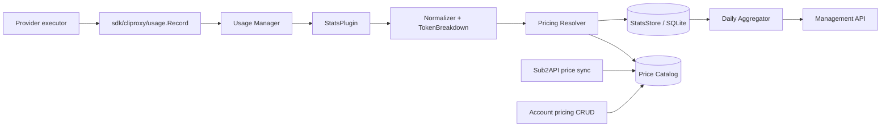

# 技术设计: 账号请求、Token 与金额统计

## 技术方案

### 核心技术

- Go 1.26，复用 `sdk/cliproxy/usage.Record` 作为事件输入契约。
- 新增 `internal/usage` 包，分为 event normalizer、pricing resolver、persistent store、aggregator 和 lifecycle wiring；不把统计逻辑放入 executor 或 translator。
- 默认使用本地 SQLite 文件 `data/usage.db`，选用纯 Go 的 `modernc.org/sqlite`（方案基线 `v1.57.0`，其 module 要求 Go 1.25，与本项目 Go 1.26 兼容）；通过 `StatsStore` 接口隔离数据库，后续可增加 Postgres 适配。
- 价格目录使用 sub2api/LiteLLM JSON 输入格式；本地保存原始 JSON、SHA-256、更新时间和解析后的规范表。
- 金额内部使用整数 nano-USD（1 USD = 1,000,000,000 nano-USD），避免 float 累计误差；API 输出十进制 USD 字符串和可选数值字段。
- 价格源和事件金额统一以 USD 为基准；不在统计写入路径做汇率换算，避免历史金额因汇率变化漂移。

### 实现要点

1. **事件入口与幂等**
   - 在 `sdk/cliproxy/usage.Record` 增加可选 `EventID`。`Manager.Publish` 在为空时生成 UUID；既有插件调用不需要改动。
   - 新增 `internal/usage.StatsPlugin`，注册到默认 usage manager。它接收每条 `Record`，补全 TokenBreakdown、账号身份、模型规范化和失败信息后提交 `StatsStore.AppendEvent`。
   - StatsPlugin 通过注入的只读 auth lookup 获取 `FileName/Label/Provider` 快照；lookup 不可用时保留 record 中的 auth_id/index，不阻塞事件写入。
   - `event_id` 为主键，重复投递只返回已存在结果；`request_id` 仅用于对账，不设为唯一键，因为一次客户端请求可能产生多个 provider attempt。
   - 事件写入不阻塞 HTTP 请求路径；usage manager 的后台 dispatcher 调用统计 sink，sink 内部采用单写 worker/事务批处理。统计写入使用应用生命周期 context，不继承已取消的下游请求 context。队列满或数据库短暂不可用时写入本地 spool，后台重放；超过重试上限必须产生错误日志和可查询失败计数。

2. **Token 归一化与金额公式**
   - 以 `TokenBreakdown` 的互斥桶为计费输入：`input.uncached_tokens`、`input.cache_read_tokens`、`input.cache_write_tokens`、`output.total_tokens`。推理 Token 已包含在 output total 中，不能再额外相加。
   - Token 统计同时保留 input/output/reasoning/cache read/cache write/unclassified，`total_tokens` 使用 canonical breakdown 的总数。
   - token 模式金额：
     `uncached_input × input_price + cache_read × cache_read_price + cache_write × cache_write_price + output_total × output_price`。
   - per-request/image 模式金额：`request_count × per_request_price` 或 `image_count × image_price`；若事件只有普通请求而没有 image count，按 1 request 处理。
   - 所有乘法使用整数或 `math/big.Int`，按 nano-USD 四舍五入；价格为显式 0 时视为已定价的免费请求，缺失价格才是 `unpriced`。
   - 事件保存 `pricing_source`、`pricing_version`、`pricing_model_key` 和实际使用的各项价格快照，确保价格目录更新不会改变历史金额。

3. **价格目录同步**
   - 默认 URL：`https://raw.githubusercontent.com/Wei-Shaw/sub2api/main/backend/resources/model-pricing/model_prices_and_context_window.json`；配置允许覆盖 URL（生产环境可改为 commit-pinned raw URL）、同步间隔、请求 User-Agent、超时和本地目录。
   - 启动时先加载最后一次有效本地文件，再按配置执行同步；定时器使用 context cancel，停止时等待同步结束。
   - HTTP 使用 ETag/Last-Modified（若服务端提供），下载内容计算 SHA-256；内容未变化只更新检查时间，不生成新版本。
   - 解析字段：`input_cost_per_token`、`output_cost_per_token`、`cache_creation_input_token_cost`、`cache_read_input_token_cost`、`output_cost_per_image`、`output_cost_per_image_token`、`input_cost_per_image_token`，并保留 `mode`、`litellm_provider`、能力元数据。
   - 负值、NaN/Inf、无法转换的模型条目拒绝；单条坏记录不影响其他记录，但同步整体必须有明确的有效条目数门槛。新原始文件和索引文件采用临时文件 + rename 原子替换。
   - 模型查找顺序：精确规范化键 → 显式 alias 映射 → provider+模型精确键；禁止仅凭 `opus`/`mini` 等子串自动猜价。查不到时记录 `unpriced`，不回退到任意价格。

4. **账号价格覆盖**
   - 独立表保存 `auth_id`、可选 provider、`model_pattern`、billing mode、各项 nano-USD 单价、priority、enabled、updated_at。
   - 匹配优先级：同账号同 provider 精确模型（priority 高者优先）→ 同账号通配模型 → 同账号 `*` 默认 → 全局目录。匹配结果在事件写入时冻结。
   - override 字段使用 nullable 语义：未填写表示继承该层默认值，显式 0 表示免费。更新采用 upsert，删除采用软禁用以保留审计记录。
   - 账号查找接受 `auth_id` 或 `auth_index`；写入时解析当前 Auth 并保存稳定 ID，找不到当前 Auth 时拒绝新规则，历史事件不受影响。

5. **聚合与查询**
   - 写入事件和 `account_usage_daily` 日聚合在同一事务中完成：事件插入成功才递增聚合；重复 `event_id` 不重复递增。`request_count` 统计 provider attempt，`request_id` 保留用于客户端请求/重试对账，不把它设为唯一。
   - 日聚合主键为 `(day, account_key, provider, model)`，字段包含 request/success/failed、各 Token、priced/unpriced、total_cost_nano_usd。
   - 常规查询先读日聚合；跨日明细、对账和 `group_by=event` 读事件表。提供 `rebuild` 内部函数按事件重建日聚合，便于修复或升级。
   - 账号删除不级联删除事件；统计查询保留事件快照名称。默认分页和最大时间范围防止管理 API 扫描过大数据集。

6. **配置建议**
   - `usage-statistics-enabled`: 复用现有总开关；为 `false` 时不写入新统计事件，既有 usage queue 行为保持兼容。
   - `usage-stats-db-path`: 默认 `data/usage.db`；`usage-retention-days`: 默认 `0`（不自动删除）。
   - `pricing-sync-enabled`: 默认 `true`；`pricing-sync-url`: 默认 sub2api raw URL；`pricing-sync-interval`: 默认 24h；`pricing-data-dir`: 默认 `data/pricing`。
   - 同步 URL、间隔、响应大小和目录权限在配置加载阶段校验；价格源错误不应阻塞代理主服务启动。

### 架构图



## 设计边界

- **范围内:** usage 事件持久化、聚合、价格目录、账号覆盖、管理查询和配置接线。
- **范围外:** executor 的上游协议、translator 行为、账号调度/冷却、用户余额扣费、管理中心前端、跨节点一致性和供应商额度主动探测。
- **模块职责:** `sdk/cliproxy/usage` 只负责发布标准事件；`internal/usage` 负责统计业务；`internal/redisqueue` 继续提供兼容的逐请求队列；Management handler 只做鉴权、参数校验和 DTO；配置负责路径/同步开关，不承载大量价格条目。
- **接口契约:** 新增 `Record.EventID`（可选，向后兼容）；新增 `StatsStore`、`PricingCatalog` 内部接口；新增 Management API，既有路由和 usage queue 响应不变。
- **数据边界:** 新增统计数据库、价格原始文件和 schema 版本；事件只追加，日聚合可重建；历史事件携带价格快照，不回算；不修改 auth JSON/token 内容。
- **依赖边界:** 复用现有 Go 标准库、Gin、UUID 和 HTTP 能力；新增依赖限定为 `modernc.org/sqlite@v1.57.0`（纯 Go，Go 1.25+）；不得引入前端框架或修改 translator 依赖。
- **大型项目最小改动:** 仅触达 usage、config、management、server wiring、stats 数据目录和测试；不迁移既有 auth store。回滚时可关闭统计开关并保留数据库文件，既有请求路径继续工作。

## 架构决策 ADR

### ADR-001: 使用持久化事件 + 日聚合，而不是只扩展内存计数
**上下文:** 当前 `Auth.Success/Failed` 和 recent request ring 是进程内状态，不能满足重启后历史统计、任意时间范围和金额审计。
**决策:** 采用只追加 usage event + 可重建日聚合；API 默认读聚合，事件用于明细和对账。
**理由:** 兼顾审计、重算能力和查询性能，且不会改变现有调度状态。
**替代方案:** 仅使用内存计数 → 拒绝，无法持久化；仅写 JSONL → 拒绝，聚合和并发查询成本高。
**影响:** 增加本地数据库和保留期运维要求；需要 schema 迁移和幂等处理。
**状态:** 已采纳

### ADR-002: 本地 SQLite 默认，存储接口预留 Postgres
**上下文:** 项目默认是文件存储，但部分部署已经配置 Postgres；统计功能需要开箱即用，也不能强制所有用户提供数据库。
**决策:** 第一阶段默认本地 SQLite，通过 `StatsStore` 接口隔离；不在本切片实现共享 Postgres 适配，后续可复用接口接入现有 PGSTORE 部署。
**理由:** 单实例零外部依赖，查询能力优于文件扫描，后续有清晰扩展点。
**替代方案:** 只支持 Postgres → 拒绝，改变默认部署门槛；继续使用内存 usage queue → 拒绝，丢失历史。
**影响:** 第一阶段多实例不会自动合并统计；文档必须明确单实例边界。
**状态:** 已采纳

### ADR-003: 使用 sub2api 文件作为默认价格源，但价格按事件快照
**上下文:** 用户要求同步 sub2api 模型价格，同时价格源可能变更、不可用或与本地模型别名不一致。
**决策:** 兼容 sub2api/LiteLLM JSON，保存源 hash/version；每条事件保存实际价格快照，未匹配模型不猜价。
**理由:** 可追溯、可审计，避免历史金额随远程文件漂移。
**替代方案:** 每次查询实时读取远程价格 → 拒绝，不稳定且无法复现历史；只保存价格 ID → 拒绝，价格记录被覆盖后无法审计。
**影响:** 事件存储字段增加；价格目录同步需要错误处理和回退。
**状态:** 已采纳

## API 设计

### `GET /v0/management/account-stats`

- **请求参数:** `auth_id` 或 `auth_index`（可选）、`provider`、`model`、`from`、`to`（UTC RFC3339）、`group_by=account|model|day|event`、`page`、`page_size`。
- **响应:**

```json
{
  "range": {"from": "...", "to": "..."},
  "items": [{
    "account_key": "...",
    "auth_index": "...",
    "provider": "codex",
    "model": "gpt-5.4",
    "request_count": 12,
    "success_count": 11,
    "failed_count": 1,
    "input_tokens": 1000,
    "output_tokens": 500,
    "reasoning_tokens": 200,
    "cache_read_tokens": 50,
    "cache_write_tokens": 20,
    "total_tokens": 1500,
    "total_cost_usd": "0.012345678",
    "priced_request_count": 11,
    "unpriced_request_count": 1
  }],
  "total": 1
}
```

### `GET /v0/management/account-pricing`

- **请求参数:** `auth_id` 或 `auth_index`（必填）。
- **响应:** 账号覆盖规则列表，返回模型 pattern、provider、billing mode、每百万 Token 价格展示值、按请求价格、enabled、priority、更新时间；不返回凭证。

### `PUT /v0/management/account-pricing`

- **请求:**

```json
{
  "auth_id": "...",
  "provider": "codex",
  "model_pattern": "gpt-5.4*",
  "billing_mode": "token",
  "input_usd_per_1m_tokens": "5",
  "output_usd_per_1m_tokens": "15",
  "cache_read_usd_per_1m_tokens": "0.5",
  "cache_write_usd_per_1m_tokens": "6.25",
  "priority": 100,
  "enabled": true
}
```

- **响应:** 规范化后的规则 ID、nano-USD 单价、匹配范围和更新时间。输入的十进制字符串必须经过范围、精度和非负校验。

### `DELETE /v0/management/account-pricing/:id`

软禁用账号覆盖规则，历史事件不变。

### `GET /v0/management/pricing/status`

返回 source URL、last_checked_at、last_success_at、content_hash、version、model_count 和 last_error。

### `POST /v0/management/pricing/sync`

触发一次手动同步；响应返回同步结果或“保持旧版本”的错误摘要，不在请求线程执行长时间重试。

### `GET /v0/management/pricing/models`

支持 `q`、`provider`、`page`，返回可用于覆盖配置的规范模型键和当前全局价格；不返回原始大 JSON。

## 数据模型

以下为 SQLite 第一阶段逻辑 schema；实际迁移应带 schema version 和幂等 `CREATE/ALTER`。

```sql
CREATE TABLE usage_events (
  event_id TEXT PRIMARY KEY,
  requested_at INTEGER NOT NULL,
  auth_id TEXT NOT NULL,
  auth_index TEXT NOT NULL DEFAULT '',
  account_label TEXT NOT NULL DEFAULT '',
  provider TEXT NOT NULL,
  auth_type TEXT NOT NULL DEFAULT '',
  request_id TEXT NOT NULL DEFAULT '',
  model TEXT NOT NULL,
  alias TEXT NOT NULL DEFAULT '',
  success INTEGER NOT NULL,
  failure_status INTEGER NOT NULL DEFAULT 0,
  input_tokens INTEGER NOT NULL DEFAULT 0,
  output_tokens INTEGER NOT NULL DEFAULT 0,
  reasoning_tokens INTEGER NOT NULL DEFAULT 0,
  cache_read_tokens INTEGER NOT NULL DEFAULT 0,
  cache_write_tokens INTEGER NOT NULL DEFAULT 0,
  unclassified_tokens INTEGER NOT NULL DEFAULT 0,
  total_tokens INTEGER NOT NULL DEFAULT 0,
  accounting_quality TEXT NOT NULL DEFAULT 'unclassified',
  pricing_model_key TEXT NOT NULL DEFAULT '',
  pricing_source TEXT NOT NULL DEFAULT 'none',
  pricing_version TEXT NOT NULL DEFAULT '',
  input_price_nano_usd INTEGER,
  output_price_nano_usd INTEGER,
  cache_read_price_nano_usd INTEGER,
  cache_write_price_nano_usd INTEGER,
  per_request_price_nano_usd INTEGER,
  total_cost_nano_usd INTEGER,
  pricing_status TEXT NOT NULL DEFAULT 'unpriced',
  created_at INTEGER NOT NULL
);
CREATE INDEX idx_usage_events_auth_time ON usage_events(auth_id, requested_at);
CREATE INDEX idx_usage_events_model_time ON usage_events(model, requested_at);
CREATE INDEX idx_usage_events_time ON usage_events(requested_at);

CREATE TABLE account_usage_daily (
  day TEXT NOT NULL,
  auth_id TEXT NOT NULL,
  provider TEXT NOT NULL,
  model TEXT NOT NULL,
  request_count INTEGER NOT NULL DEFAULT 0,
  success_count INTEGER NOT NULL DEFAULT 0,
  failed_count INTEGER NOT NULL DEFAULT 0,
  input_tokens INTEGER NOT NULL DEFAULT 0,
  output_tokens INTEGER NOT NULL DEFAULT 0,
  reasoning_tokens INTEGER NOT NULL DEFAULT 0,
  cache_read_tokens INTEGER NOT NULL DEFAULT 0,
  cache_write_tokens INTEGER NOT NULL DEFAULT 0,
  unclassified_tokens INTEGER NOT NULL DEFAULT 0,
  total_tokens INTEGER NOT NULL DEFAULT 0,
  priced_request_count INTEGER NOT NULL DEFAULT 0,
  unpriced_request_count INTEGER NOT NULL DEFAULT 0,
  total_cost_nano_usd INTEGER NOT NULL DEFAULT 0,
  PRIMARY KEY(day, auth_id, provider, model)
);

CREATE TABLE model_pricing (
  model_key TEXT PRIMARY KEY,
  provider TEXT NOT NULL DEFAULT '',
  source_model TEXT NOT NULL DEFAULT '',
  input_price_nano_usd INTEGER,
  output_price_nano_usd INTEGER,
  cache_read_price_nano_usd INTEGER,
  cache_write_price_nano_usd INTEGER,
  per_request_price_nano_usd INTEGER,
  image_price_nano_usd INTEGER,
  billing_mode TEXT NOT NULL DEFAULT 'token',
  source_version TEXT NOT NULL,
  updated_at INTEGER NOT NULL
);

CREATE TABLE pricing_sync_state (
  singleton INTEGER PRIMARY KEY CHECK (singleton = 1),
  source_url TEXT NOT NULL,
  last_checked_at INTEGER,
  last_success_at INTEGER,
  content_hash TEXT NOT NULL DEFAULT '',
  version TEXT NOT NULL DEFAULT '',
  model_count INTEGER NOT NULL DEFAULT 0,
  last_error TEXT NOT NULL DEFAULT ''
);

CREATE TABLE account_pricing_overrides (
  id TEXT PRIMARY KEY,
  auth_id TEXT NOT NULL,
  provider TEXT NOT NULL DEFAULT '',
  model_pattern TEXT NOT NULL,
  billing_mode TEXT NOT NULL DEFAULT 'token',
  input_price_nano_usd INTEGER,
  output_price_nano_usd INTEGER,
  cache_read_price_nano_usd INTEGER,
  cache_write_price_nano_usd INTEGER,
  per_request_price_nano_usd INTEGER,
  image_price_nano_usd INTEGER,
  priority INTEGER NOT NULL DEFAULT 0,
  enabled INTEGER NOT NULL DEFAULT 1,
  updated_at INTEGER NOT NULL
);
CREATE INDEX idx_account_pricing_match ON account_pricing_overrides(auth_id, provider, model_pattern, priority);
```

## 安全与性能

- **安全:** 统计数据库目录权限 0700；Management API 复用现有鉴权；日志只记录 event_id、auth_id/hash、模型和错误摘要；禁止写入 API key、access token、请求 prompt 或完整响应；价格同步 URL 必须经过 URL 校验并限制响应大小。
- **性能:** usage sink 单写事务批处理，事件表按账号/时间和模型/时间建索引；API 默认时间范围和 page size 上限；日聚合用于图表查询；价格目录在内存中读锁保护，单次请求不访问网络。
- **可靠性:** 数据库迁移启动前执行 schema version 检查；同步文件和 spool 使用原子写入；shutdown 先停止接收新统计再 drain worker；数据库不可用时明确暴露 `stats_sink_failed` 指标/日志。
- **保留策略:** 配置 `usage-retention-days`，到期事件归档/删除前先更新聚合；删除是显式运维动作，默认不自动破坏历史。

## 测试与部署

- **测试:** 先覆盖 Record.EventID 和 StatsPlugin 幂等；再覆盖 TokenBreakdown/金额公式、价格优先级、sub2api JSON 解析、同步失败回退、聚合事务和 API 参数/鉴权。使用临时 SQLite 文件做集成测试，并加入并发写入与重放测试。
- **验证命令:** `gofmt -w <changed-go-files>`；`go test ./internal/usage/... ./sdk/cliproxy/usage/... ./internal/api/handlers/management/...`；`go test ./...`；`go build -o cli-proxy-api ./cmd/server`。
- **部署:** 新配置默认关闭或以明确的 `usage-statistics-enabled` 开关控制；首次启用创建 `data/usage.db` 和价格目录；启动加载旧目录后异步同步，不阻塞代理对外启动；升级执行幂等 schema migration。
- **回滚:** 关闭统计开关即可停止新事件写入；既有请求路径和 usage queue 保持；数据库和价格文件保留，重新启用后继续追加。

## 知识库同步

- 更新 `helloagents/main/wiki/modules/sdk.md`：补充 usage event、统计 sink 和价格快照职责。
- 更新 `helloagents/main/wiki/data.md`：补充 `usage_events`、`account_usage_daily`、价格目录和账号覆盖规则。
- 更新 `helloagents/main/wiki/api.md`：补充 Management API 参数和响应摘要。
- 更新 `helloagents/main/wiki/glossary.md`：加入“Usage Event”“Pricing Snapshot”“Account Pricing Override”“Unpriced”等术语。
