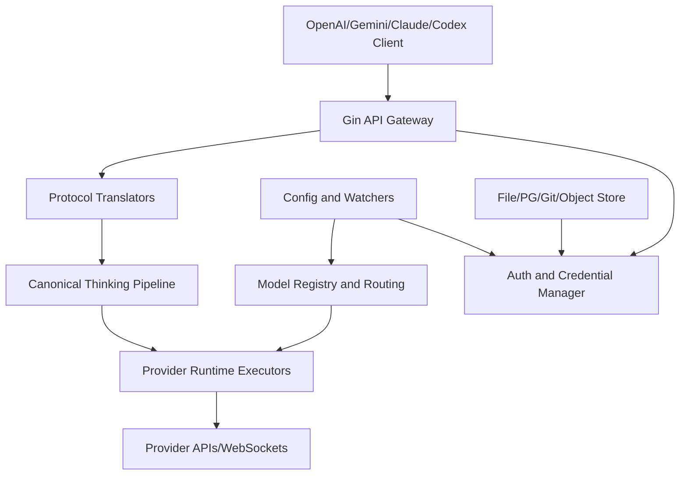
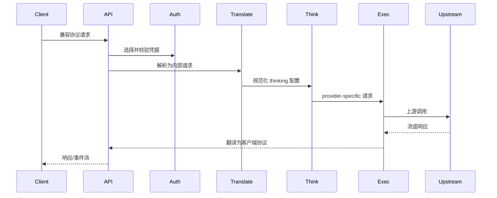

# 架构设计

## 总体架构

## 技术栈
- **后端:** Go 1.26, Gin
- **传输:** HTTP(S), WebSocket, WebRTC
- **数据:** YAML 配置、文件凭据；可选 PostgreSQL、Git、对象存储和 Redis

## 核心流程

## 重大架构决策
| adr_id | title | date | status | affected_modules | details |
|---|---|---|---|---|---|
| - | 当前初始化未记录独立 ADR | 2026-08-30 | - | - | - |

